# Nice Start

Esta es mi primera aplicación con Android Studio

## Mi pantalla de carga
Esta pantalla cuenta con una animación en el logo en la que se mueve para arriba y luego vuelve a bajar (transition), tiene un blink y rota sobre si mismo.


## Mi pantalla de Login

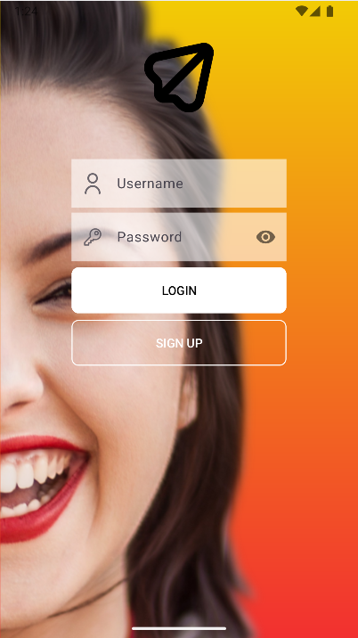

## Mi pantalla de Registro

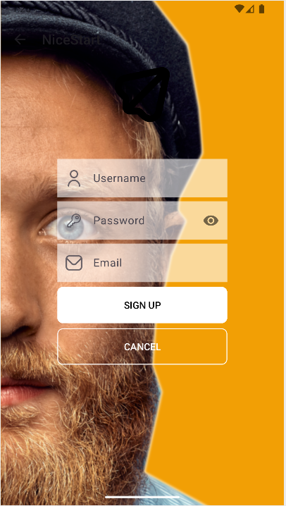

## Mi pantalla principal
Esta pantalla cuenta con un menú contextual al mantener pulsado el texto situado en el centro.
También cuenta con un menú appbar y con un swipe refresh.

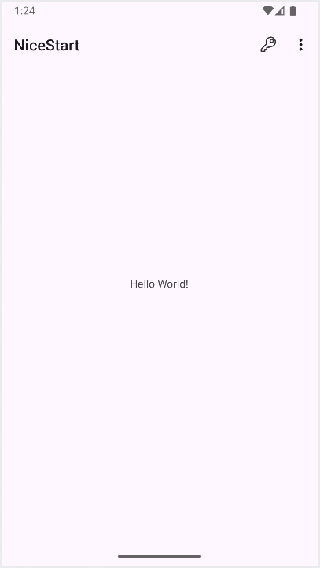

### Menú contextual
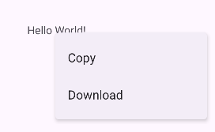

### Menú appbar
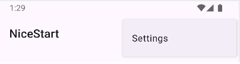

### Swipe Refresh


## The key...
En el centro podemos ver un texto indicandonos que encontremos la llave.
La llave en un icono ubicado en el menú action bar (arriba a la derecha).

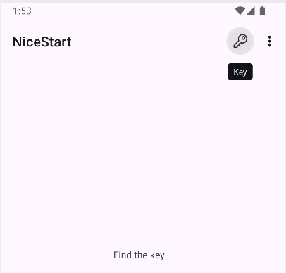

Al pulsarlo nos aparece un snackbar diciendonos que hemos encontrado la llave y si queremos devolverla (devolverla sería reiniciar el juego).

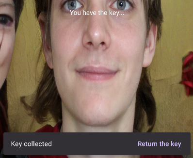

### Snackbar
```java
Snackbar snackbar = Snackbar.make(findViewById(R.id.itemKey), "Key collected", BaseTransientBottomBar.LENGTH_LONG);

snackbar.setAction("Return the key", new View.OnClickListener() {
    @Override
    public void onClick(View v) {
        mycontext.setText("Find the key...");
    }
});

snackbar.show();
```

## Dialogo modal
El dialogo modal se muestra al hacer click en los tres puntitos del app bar y pulsar en la opción settings.

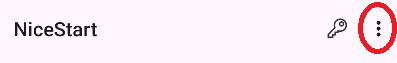 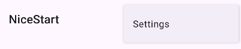

La opción de "Yes" cierra la aplicación.
La opción de "No" cierra el dialogo modal y muestra un Toast.
La opción "Do nothing" simplemente cierra el dialogo modal.

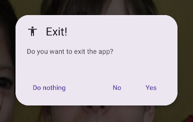

```java
public void showAlertDialogButtonClicked(MainActivity mainActivity) {
    MaterialAlertDialogBuilder builder = new MaterialAlertDialogBuilder(mainActivity);

    builder.setTitle("Exit!");
    builder.setMessage("Do you want to exit the app?");
    builder.setIcon(R.drawable.person);

    builder.setNeutralButton("Do nothing", new
            DialogInterface.OnClickListener() {
                @Override
                public void onClick(DialogInterface dialog, int which) {
                    dialog.dismiss();
                }
            });

    builder.setNegativeButton("No", new
            DialogInterface.OnClickListener() {
                @Override
                public void onClick(DialogInterface dialog, int which) {
                    Toast.makeText(mainActivity, "Okay", Toast.LENGTH_SHORT).show();
                    dialog.dismiss();
                }
            });

    builder.setPositiveButton("Yes", new
            DialogInterface.OnClickListener() {
                @Override
                public void onClick(DialogInterface dialog, int which) {
                    System.exit(0);
                }
            });

    AlertDialog dialog = builder.create();
    dialog.show();
}
```

## WebView
En este caso probamos el WebView usandolo como fondo del MainActivity. 

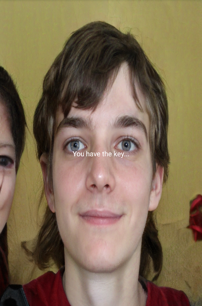

### Implementación
En el onCreate del activity deseado

```java
@Override
protected void onCreate(Bundle savedInstanceState) {
    ... // resto del código
    myWebView = (WebView) findViewById(R.id.wvVistaWeb);
    registerForContextMenu(myWebView);

    // Inserción HTML
    String html = "<html>" +
            "<head><style>" +
            "html, body { margin:0; padding: 0; height: 100%; overflow: hidden; }" +
            "img {width: 100%; height: 100%; object-fit: over }" +
            "</style></head>" +
            "<body>" +
            "" +
            "</body></html>";

    myWebView.loadDataWithBaseURL(null, html, "text/html", "UTF-8", null);
}
```

Y en el onRefresh del swipe refresh
```java
protected SwipeRefreshLayout.OnRefreshListener
            mOnRefreshListener = new SwipeRefreshLayout.OnRefreshListener() {
        @Override
        public void onRefresh() {
            ... // el resto del código (en mi caso no hay más)
            myWebView.reload();
            swipeLayout.setRefreshing(false);
        }
    };
```

## Internalización
Ahora mismo la aplicación cuenta con dos el idioma por defecto (ingles) y el agregado que es el Español.

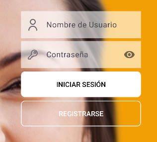

## Modo oscuro
El modo oscuro es ahora mismo un estandar ya que más del 50% de los usuarios prefieren y utilizan el modo oscuro en su día a día.
Por no hablar de todos sus beneficios...

### En el Login
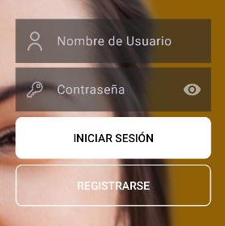

### En la pantalla principal
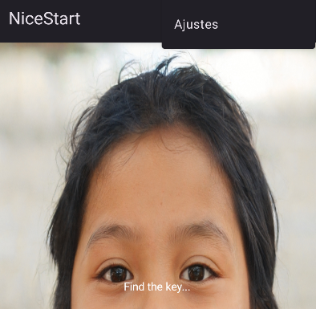

## Bottom app bar
La aplicación cuenta con un bottom app bar con diferentes opcionar y que al hacer croll se oculta automaticamente.

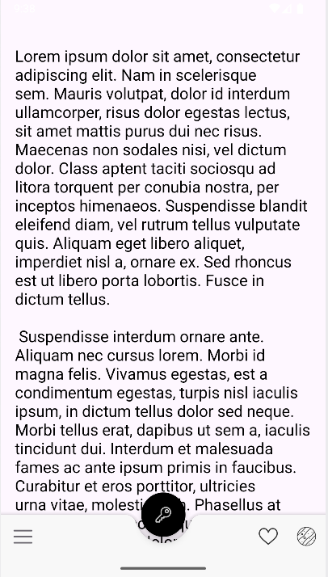
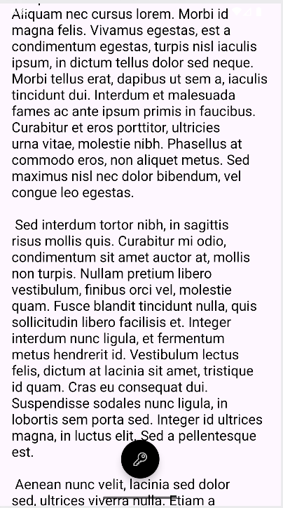

### Funcionalidad del menú
Los botones de la derecha (el corazón y el planeta) muestran un toast.
Mientras que el icono de hamburguer abre un bottom sheet menu con tres opciones distintas, cada una con su funcionalidad.

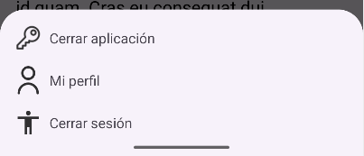

- Cerrar aplicación cierra la app usando:
```java
option1.setOnClickListener(new View.OnClickListener() {
    @Override
    public void onClick(View v) {
        bottomSheetDialog.dismiss();
        System.exit(0);
    }
});
```
- Mi perfil habre el activity Profile:
```java
option2.setOnClickListener(new View.OnClickListener() {
    @Override
    public void onClick(View v) {
        bottomSheetDialog.dismiss();
        Intent intent = new Intent(MainBab.this, Profile.class);
        intent.addFlags(Intent.FLAG_ACTIVITY_NEW_TASK);
        startActivity(intent);
    }
});
```
- Y cerrar sesión simplemente muestra un toast:
```java
option3.setOnClickListener(new View.OnClickListener() {
    @Override
    public void onClick(View v) {
        Toast.makeText(MainBab.this, "Logout clicked", Toast.LENGTH_SHORT).show();
        bottomSheetDialog.dismiss();
    }
});
```

## Navigation drawer


### ¿Cómo lo he agregado?
Primero, he modificado el activity_main_bab.xml y he contenido todo en un <androidx.drawerlayout.widget.DrawerLayout/>, de esta forma:
```xml
<?xml version="1.0" encoding="utf-8"?>
<androidx.drawerlayout.widget.DrawerLayout xmlns:android="http://schemas.android.com/apk/res/android"
    xmlns:app="http://schemas.android.com/apk/res-auto"
    android:id="@+id/drawer_layout"
    android:layout_width="match_parent"
    android:layout_height="match_parent"
    android:fitsSystemWindows="true">
    ... <!-- El resto del fichero -->
</androidx.drawerlayout.widget.DrawerLayout>
```

Dentro del mismo fichero y contenido también por el DrawerLayout he agregado un <NavigationView/>
```xml
<?xml version="1.0" encoding="utf-8"?>
<androidx.drawerlayout.widget.DrawerLayout>
    ... <!-- El resto del fichero -->
    <com.google.android.material.navigation.NavigationView
        android:id="@+id/nav_view"
        android:layout_width="wrap_content"
        android:layout_height="match_parent"
        android:layout_gravity="start"
        app:menu="@menu/bottom_sheet_menu" />
</androidx.drawerlayout.widget.DrawerLayout>
```

El layout que tenemos para el bottom sheet no nos sirve para este DrawerLayout por lo que tenemos que crear un menú con este contenido:
```xml
<?xml version="1.0" encoding="utf-8"?>
<menu xmlns:android="http://schemas.android.com/apk/res/android">
    <item
        android:id="@+id/option01"
        android:icon="@drawable/keyicon"
        android:title="@string/close_app" />
    <item
        android:id="@+id/option02"
        android:icon="@drawable/usericon"
        android:title="@string/my_profile" />
    <item
        android:id="@+id/option03"
        android:icon="@drawable/person"
        android:title="@string/logout" />
</menu>
```

En el fichero MainBab.java, el que contiene la lógica, he creado un nuevo método llamado showNavigationDrawer():
```java
private void showNavigationDrawer(){
    DrawerLayout drawerLayout = findViewById(R.id.drawer_layout);
    NavigationView navigationView = findViewById(R.id.nav_view);

    drawerLayout.openDrawer(GravityCompat.START);

    navigationView.setNavigationItemSelectedListener(item -> {
        int id = item.getItemId();

        if (id == R.id.option01) {
            System.exit(0);
        } else if (id == R.id.option02) {
            Intent intent = new Intent(MainBab.this, Profile.class);
            intent.addFlags(Intent.FLAG_ACTIVITY_NEW_TASK);
            startActivity(intent);
        } else if (id == R.id.option03) {
            Toast.makeText(MainBab.this, "Logout clicked", Toast.LENGTH_SHORT).show();
        }

        // Cerrar el menú al hacer clic
        drawerLayout.closeDrawer(GravityCompat.START);
        return true;
    });
}
```
Y para que no se ejecute el bottom sheet y el drawer layout, he comentado el método showBottomSheetDialog().

Ahora, cuando pulsamos el icono de hamburguer en nuestro bottom app bar se abre el menú lateral.
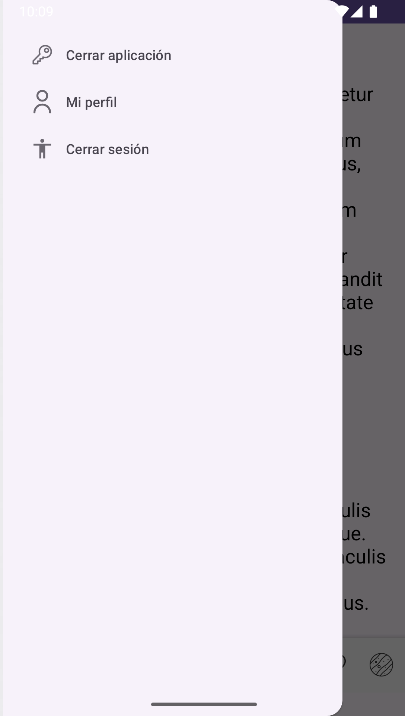

> ##### Si consideras útil el repositorio, apóyalo haciendo "★ Star" en el repositorio. ¡Gracias!

>This repository is licensed under
>[Creativecommons Org Licenses By Sa 4](http://creativecommons.org/licenses/by-sa/4.0/)