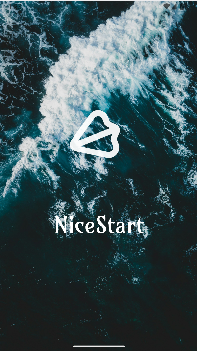

# Nice Start

## Mi primer proyecto en android studio

```xml
<com.google.android.material.textfield.TextInputLayout
    android:layout_width="0dp"
    android:layout_height="wrap_content"
    app:passwordToggleEnabled="true"
    app:startIconDrawable="@drawable/keyicon">
    
    <EditText
        android:layout_width="match_parent"
        android:layout_height="wrap_content"
        android:alpha="0.6"
        android:background="@android:color/white"
        android:hint="@string/password"
        android:inputType="textPassword"
        android:drawableLeft="@drawable/keyicon"/>
    
</com.google.android.material.textfield.TextInputLayout>
```

### Mi pantalla de carga
Esta pantalla cuenta con una animación en el logo en la que se mueve para arriba y luego vuelve a bajar (transition), tiene un blink y rota sobre si mismo.



### Mi pantalla de Login


### Mi pantalla de Registro


### Mi pantalla principal
Esta pantalla cuenta con un menú contextual al mantener pulsado el texto situado en el centro.
También cuenta con un menú appbar y con un swipe refresh.


 


> ##### Si consideras útil el repositorio, apóyalo haciendo "★ Star" en el repositorio. ¡Gracias!

>This repository is licensed under
>[Creativecommons Org Licenses By Sa 4](http://creativecommons.org/licenses/by-sa/4.0/)